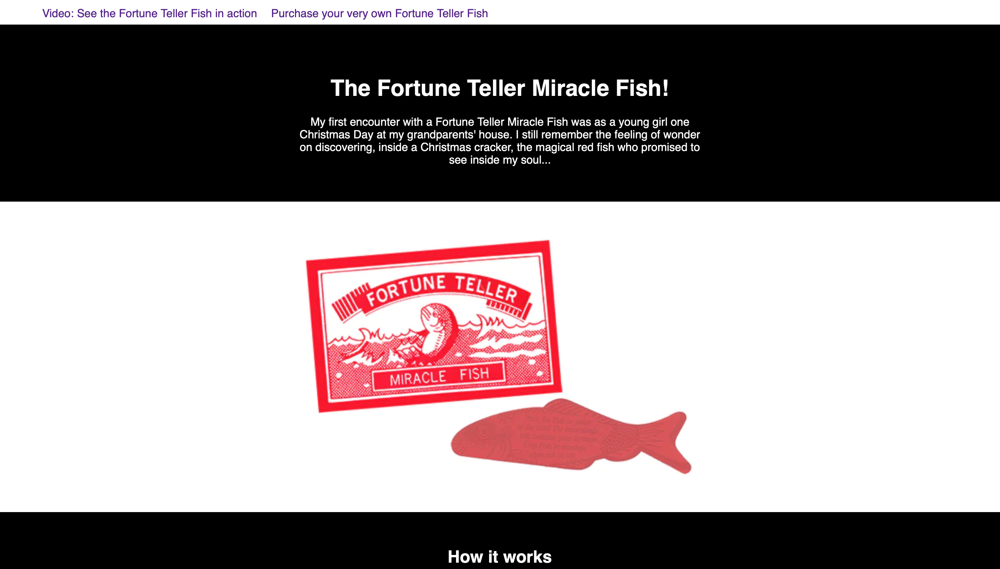

# Code First Girls Web Development Course

This is my second homework assignment for week 2 of the Code First Girls (https://codefirstgirls.com) Web Dev course.

### The brief

To use CSS to style a two-page website according to a specified design.

### Screenshot

### Links

- Repository URL: https://github.com/jengori/miracle-fish-css
- Live Site URL: https://jengori.github.io/miracle-fish-css/